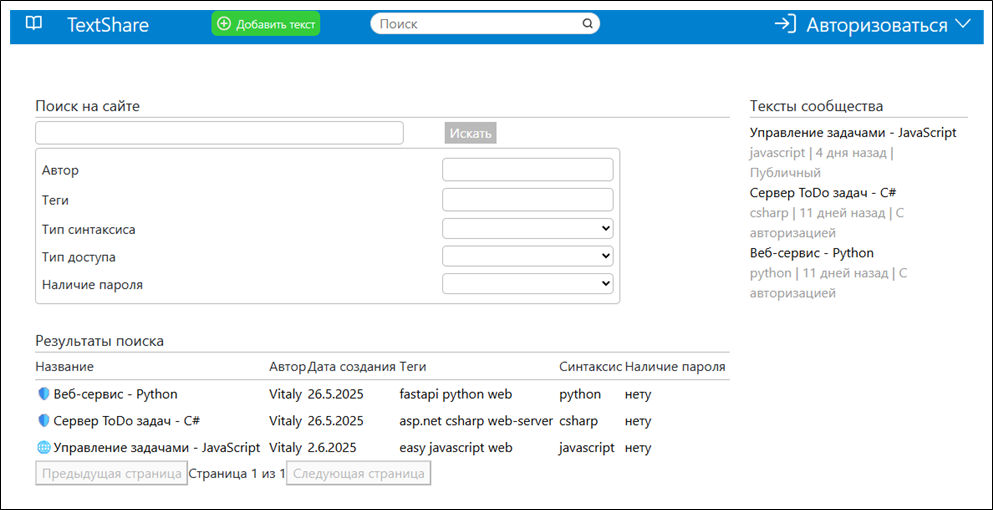
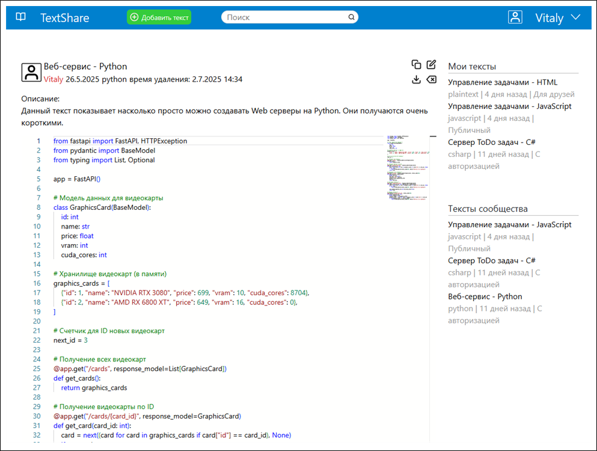
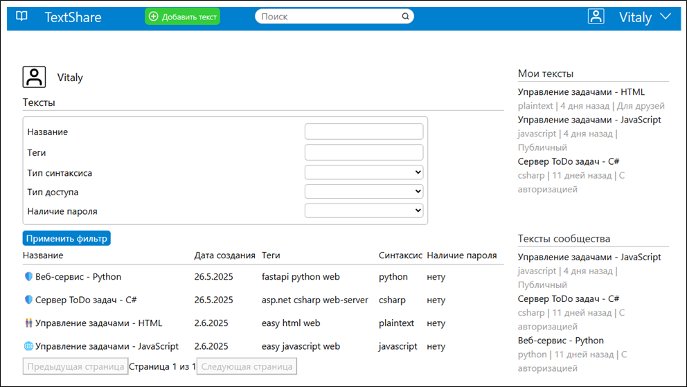

# 📘 TextShare — веб-сервис для хранения и редактирования текстов

---

## 🧩 Описание проекта

**TextShare** — это веб-приложение, разработанное для **хранения, редактирования и публикации текстовых документов**. Приложение позволяет пользователям:
- Создавать и редактировать тексты.
- Устанавливать уровень доступа к тексту (публичный, приватный, только для друзей, только авторизованным пользователям).
- Назначать теги для удобного поиска.
- Устанавливать для каждого текста синтаксис языка программирования.
- Назначать дату деактивации и удаления текста из системы.
- И многое другое!

Проект состоит из трех частей:
- **Серверная часть**: REST API на основе ASP.NET Core Web API.
- **Клиентская часть**: одностраничное приложение (SPA) на React + TypeScript.
- **База данных**: хранение данных (PostgreSQL).

---

## 🕶️ Презентация проекта

### 📕 Окно поиска текстов



### 📗 Окно чтения текстов



### 📘 Окно профиля пользователя



## 📁 Структура проекта

```
TextShare/
├── TextShareAPI/                # Серверная часть на ASP.NET Core
|   ├── Attributes/              # Валидационные атрибуты
│   ├── certs/                   # Самоподписанный сертификат
│   ├── ClassesLib/              # Вспомогательные классы для разработки
│   ├── Controllers/             # Контроллеры API
│   ├── Data/                    # Контекст для Entity Framework
│   ├── Dtos/                    # Используемые DTO 
│   ├── Extensions/              # Классы расширений
│   ├── Models/                  # Модели данных для Entity Framework
│   ├── Dtos/                    # DTO-объекты для обмена данными
│   ├── Repositories/            # Репозитории для работы с базой данных
│   ├── Services/                # Бизнес-логика приложения
│   ├── appsettings.json         # Конфигурация приложения
│   └── Dockerfile               # Для сборки контейнера серверной части
│
├── text-share-client/           # Клиентская часть на React + TypeScript
│   ├── public/                  # Статические файлы
│   ├── src/
│   │   ├── App.tsx              # Главный компонент
│   │   ├── Сomponents/          # Вспомогательные компоненты
│   │   ├── Context/             # Используемые классы контекста клиента
│   |   ├── Pages/               # Страницы клиента
│   |   ├── Router/              # Навигационные пути
│   │   └── Services/            # Вспомогательные сервисы
│   ├── package.json             # Зависимости и скрипты
│   └── Dockerfile               # Для сборки контейнера клиентской части
│
├── TextShareAPI.Benchmarks/     # Папка с бенчмарками производительности
│   ├── Benchmarks/              # Бенчмарки-сравнения
│   └── Benchmarks.csproj
│
├── TextShareAPI.Tests/          # Папка с нагрузочными тестами k6
│   ├── TextLoadTests/           # Нагрузочное тестирование
│   ├── Texts/                   # Тексты для тестирования
│   └── Tests.js                 # Тестовый сценарий k6
│
└── docker-compose.yml           # Конфигурация для запуска через Docker
```

---

## 🛠 Технологии

| Компонент | Технология |
|-----------|------------|
| **Backend** | ASP.NET Core Web API 9, C#, Entity Framework Core |
| **Frontend** | React, TypeScript, Monaco Editor |
| **База данных** | PostgreSQL |
| **Инструменты разработки** | Rider IDE, VS Code, .NET CLI, npm |
| **Тестирование** | k6 (нагрузочное тестирование), BenchmarkDotNet (бенчмарки) |

---

## ✅ Основные функции

### 🖋 Редактор текстов
- Поддержка подсветки синтаксиса (через Monaco Editor).
- Возможность сохранять и загружать тексты.
- Добавление описания, тегов и выбор типа синтаксиса.
- Добавление даты удаления текста из системы
- Добавление пароля

### 🔐 Управление доступом
- Различные уровни доступа к текстам:
  - `ByReferencePublic` — открытый доступ.
  - `ByReferenceAuthorized` — доступ только авторизованным пользователям.
  - `OnlyFriends` — доступ только друзьям.
  - `Personal` — приватный текст.
- Пароли хешируются стандартным алгоритмом PBKDF2 (HMAC-SHA512)
- Авторизация через JWT-токены.

### 🔍 Поиск текстов
- Поиск по ID текста.
- Фильтрация по типу доступа, тегам, синтаксису и другим параметрам.

### 💾 Хранение текстов
- Тексты и их метаданные хранятся в PostgreSQL, так как бенчмарки показали его высокую 
эффективность для хранения текстов разной длины (результаты бенчмарков будут ниже).

---

## ⚙️ Как запустить проект

### 🐳 С помощью Docker Compose

1. Установите [Docker Desktop](https://www.docker.com/products/docker-desktop/).
2. Перейдите в корень проекта.
3. Выполните команду:

```bash
docker-compose up --build
```

4. После запуска:
   - Клиент будет доступен по адресу: `http://localhost`
   - Сервер будет доступен по адресу: `https://localhost:7285`
   - База данных будет доступна по адресу: `https://localhost:9342`

> ⚠️ Убедитесь, что порты `80`, `7285` и `9342` свободны.

---

## 🧪 Бенчмарки: Сравнение PostgreSQL и MinIO

В рамках проекта было проведено сравнение производительности двух способов хранения текстов:
- **PostgreSQL** (поле `TEXT`)
- **MinIO** (хранилище объектов)

### ✏️ Условия тестирования
- В хранилища предварительно были записаны 1000 текстов разных размерностей
- Во время тестирования проверяется скорость получения текстов из хранилища

### 📊 Результаты тестирования

| Метод                      | Среднее время (μs) | Ошибка (μs) | Среднее медианное значение (μs) |
|----------------------------|--------------------|-------------|----------------------------------|
| PostgresSmallTextLoad      | 366.9 μs           | 7.33 μs     | 361.1 μs                         |
| PostgresMediumTextLoad     | 1,594.1 μs         | 36.76 μs    | 1,567.5 μs                       |
| PostgresLargeTextLoad      | 26,839.3 μs        | 503.17 μs   | 26,725.6 μs                      |
| MinioSmallTextLoad         | 972.6 μs           | 19.45 μs    | 956.6 μs                         |
| MinioMediumTextLoad        | 1,713.7 μs         | 39.90 μs    | 1,696.6 μs                       |
| MinioLargeTextLoad         | 20,469.7 μs        | 674.13 μs   | 20,455.2 μs                      |

> ✅ **Выбор в пользу PostgreSQL**
>
> PostgreSQL показал значительно большую эффективность в получении текстов малого и среднего объема. На текстах крайне большой размерности MinIO оказался лучше, но не значительно. Был сделан выбор в пользу PostgreSQL для хранения текстов.

---

## 📈 Нагрузочное тестирование с помощью k6

Проведено нагрузочное тестирование API с использованием инструмента **k6**. Типы тестов:
- **Стандартное тестирование** (нормальная нагрузка).
- **Стресс-тестирование** (высокая нагрузка).
- **Длительное тестирование** (Soak Testing).
- **Нагрузка с ростом VUs**.

### 📦 Тесты находятся в папке `TextShareAPI.Tests`.

Для отображения web dashboard:
```bash
# powershell
$Env:k6_web_dashboard = true

# Linux shell
export MY_VARIABLE=true
```

Пример запуска теста (не забудьте указать логин и пароль):
```bash
k6 run --env USERNAME= --env PASSWORD= .\stress_test.js
```

> 📊 Результаты тестов позволяют оценить:

Результаты представлены в папке `TextShareApi.Tests/TextLoadTests/Results`

- Пропускную способность API.
- Время ответа на запросы.
- Порог появления необработанных запросов.
- Стабильность при высоких нагрузках.


---

## 🧱 Архитектура

### 🖥 Серверная часть (ASP.NET Core)
- **Разделена на слои**:
  - **Controllers** — принимают HTTP-запросы.
  - **Services** — реализуют бизнес-логику.
  - **Repositories** — взаимодействуют с базой данных.
  - **DTO** — используются для передачи данных между клиентом и сервером.

- **Поддерживается DI (Dependency Injection)** для модульной структуры.

### 🌐 Клиентская часть (React + TypeScript)
- Реализована с использованием:
  - **React Hooks** для управления состоянием.
  - **Monaco Editor** для редактирования текста.
  - **React Router** для навигации.
  - **Cookies** для хранения токена и имени пользователя.


---

## 🔄 Интеграция с внешними сервисами

| Сервис       | Назначение                            | Примечание                              |
|--------------|--------------------------------------|-----------------------------------------|
| **JWT Auth** | Авторизация пользователей            | Используется `js-cookie` для хранения   |
| **PostgreSQL** | Хранение метаданных текстов         | Используется Entity Framework Core      |
| **Monaco Editor** | Подсветка синтаксиса              | Интегрирован через CDN и рефы           |


---

## 🧪 Тестирование

| Тип теста | Описание |
|-----------|----------|
| **Функциональные тесты** | Проверка работы основных функций системы |
| **K6 Load тесты** | Измерение производительности API под нагрузкой |
| **BenchmarkDotNet** | Сравнение времени чтения текстов из разных хранилищ |
